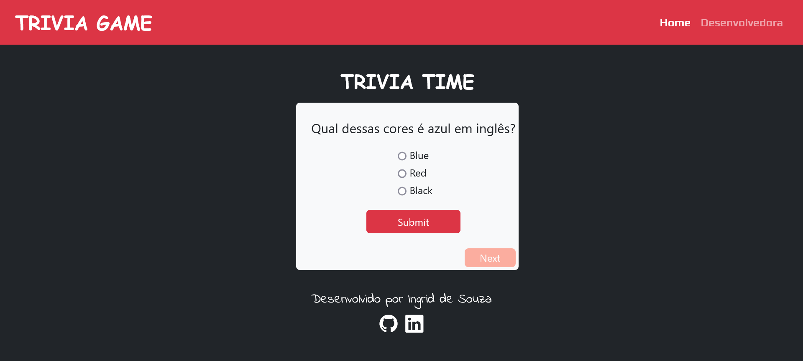
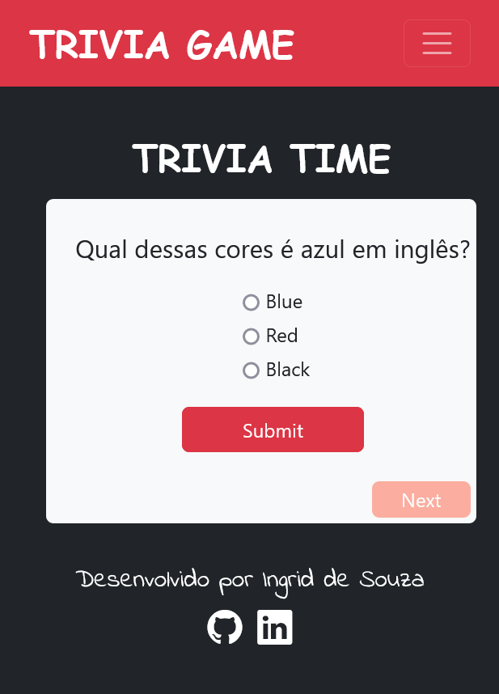

# Trivia Game

Este é um site com algumas perguntas e respostas, onde você pode passar algum tempo se divertindo respondendo perguntas básicas e de conhecimento geral.
 
É possível:

- Seguir para a próxima pergunta;
- Responder as perguntas e ter uma resposta positiva ou negativa.

## Table of contents

- [Screenshot](#screenshot)
- [Links](#links)
- [My process](#my-process)
  - [Built with](#built-with)
- [Author](#author)

### Screenshot

<h1 style="text-align: center;">Mobile</h1>

### Links

- Solution URL: [Solution URL here](https://ingridssilveira.github.io/trivia-game/)

## My process

### Built with

- Semantic HTML5 markup
- CSS
- Flexbox
- Bootstrap
- Sass
- Javascript

## Author

- Website - [Ingrid Souza](https://ingridssilveira.github.io/IngridSouza/)
